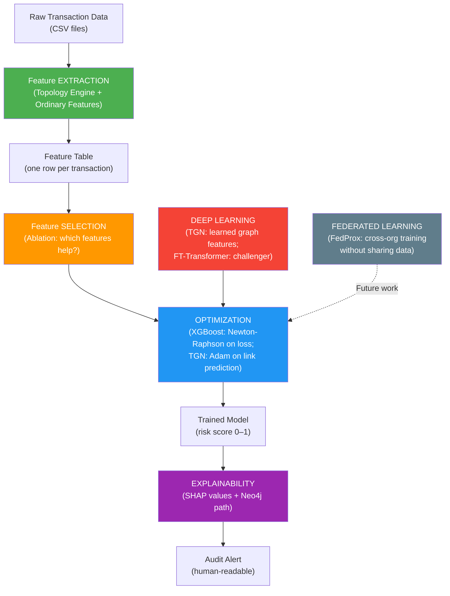

# Key ML/DL Concepts — Explained for the Shadow Graph Project

> **Purpose:** Explain each concept plainly, then show exactly how it fits (or doesn't fit) into our project.

---

## 1. Feature Extraction

### What it is
Feature extraction is the process of **transforming raw data into numerical measurements** (features) that a machine-learning model can use. You take something messy (a graph, an image, a document) and turn it into a row of numbers.

### In our project
This is the **heart of Phase 1** — the Temporal Topology Engine. We take a raw transaction graph and *extract* numerical features from it:

| Raw data | → Extracted feature | What it measures |
|---|---|---|
| The graph neighbourhood of account B | `fan_in = 12` | 12 distinct senders paid B recently |
| A closed loop A→B→C→A | `in_cycle = 1`, `cycle_length = 3` | This transaction closes a 3-hop money loop |
| Amounts around a loop | `cycle_amount_ratio = 0.95` | 95% of the money was conserved (laundering signal) |
| Account A's past transactions | `src_amt_mean_prior = 4500` | A's historical average payment is $4,500 |

We also extract **ordinary features** from the flat transaction data (log of amount, time since previous transaction, account statistics). The topology features are the *graph-based* extracted features — that's what makes the project novel.

> **Key rule:** All our extraction is **as-of / past-only** — for a transaction at time T, we only use data with timestamp ≤ T. This prevents data leakage.

---

## 2. Feature Selection

### What it is
Feature selection is **choosing which features to keep** and which to discard before training. Not all features help — some are redundant, some are noisy, some leak information. Selection improves model performance and interpretability.

### Methods
| Method | How it works |
|---|---|
| **Filter methods** | Rank features by a statistical score (correlation, mutual information, variance) — fast, model-independent |
| **Wrapper methods** | Train the model with different feature subsets, pick the best (e.g., forward/backward selection) — accurate but expensive |
| **Embedded methods** | The model itself selects features during training (e.g., XGBoost's feature importance, L1/Lasso regularisation) |

### In our project
Feature selection is something we do **rigorously through the ablation experiment**:

- We discovered that **cycle features are redundant with density** (fan-in/in-degree already captures the same signal → A.4c). Selection verdict: cycles add +0.001, not worth the complexity.
- We found that **lapping features are amount-derived** (they re-smuggle the amount signal → A.4d). Selection verdict: reclassified from "topology" to "amount-derived."
- The ablation's 7-model design IS a systematic feature-selection experiment: baseline → +topology → +structure-only → topology-only, etc.
- XGBoost's built-in **feature importance** (gain-based and, in future, SHAP-based) acts as an embedded feature selector — it told us `log_amount` dominates IBM AML and `dest_in_degree` drives BankSim.

> **What we could add (for the presentation):** A formal filter step (e.g., drop features with <0.01 mutual information with the label) before training, or L1-regularised logistic regression as a feature-selection baseline. This is straightforward and would strengthen the "we're rigorous" narrative.

---

## 3. Feature Extraction vs. Feature Selection — The Distinction

| | Feature Extraction | Feature Selection |
|---|---|---|
| **What** | Create new features from raw data | Choose which existing features to keep |
| **When** | Before the feature table exists | After the feature table exists, before training |
| **Example** | Computing `fan_in` from the graph | Dropping `cycle_length` because it's redundant with `dest_in_degree` |
| **Our project** | The Topology Engine (Phase 1) | The Ablation experiment (Phase 2) |

In our pipeline: **Extraction** (Topology Engine) → Feature Table → **Selection** (Ablation / importance analysis) → Model Training.

---

## 4. Optimization Algorithms

### What it is
An optimization algorithm is **how a model learns** — it finds the set of parameters (weights) that minimize a loss function (the model's error). Different algorithms make different trade-offs between speed, stability, and ability to escape bad solutions.

### Common optimization algorithms

| Algorithm | Used by | Key idea |
|---|---|---|
| **Gradient Descent (GD)** | Everything | Move parameters in the direction that reduces loss — the "downhill" direction |
| **Stochastic GD (SGD)** | Neural networks | Use a random mini-batch instead of all data per step — faster, noisier |
| **Adam** | Neural networks (default) | SGD + adaptive per-parameter learning rates + momentum — fast convergence |
| **AdamW** | Transformers | Adam with decoupled weight decay — better regularisation |
| **Second-order methods** | XGBoost/LightGBM | Use the loss curvature (Hessian) to make smarter steps — why trees train fast |

### In our project

| Component | Optimizer | Why |
|---|---|---|
| **XGBoost** (our champion) | Newton-Raphson (second-order) on the loss for each tree split | Built into XGBoost — it uses gradient + Hessian of the loss to find optimal splits. We don't choose this; it's the algorithm's core. |
| **Focal loss** (`modeling/objectives.py`) | Custom gradient + numeric Hessian passed to XGBoost | We replaced the default log-loss with focal loss (γ-parameterised) to down-weight easy negatives. XGBoost's optimizer uses our custom gradients. |
| **TGN** (`modeling/tgn.py`) | Adam (via PyTorch) | The temporal graph network's GRU memory is trained with Adam on a self-supervised link-prediction loss. |
| **FT-Transformer** (planned) | AdamW | The standard optimizer for transformer architectures (per MODERNIZATION_REPORT). |
| **Threshold tuning** | Grid search on validation PR-AUC | A simple 1D optimization: sweep cutoff values 0.01–0.99, pick the one that maximises F1 on validation, freeze it. |

> **What we could add:** Hyperparameter optimization (Optuna/Bayesian optimization) for XGBoost's `learning_rate`, `max_depth`, `n_estimators`, `scale_pos_weight`. Currently we use reasonable defaults — a formal HPO step would make results more defensible.

---

## 5. Deep Learning / CNN Models for Feature Extraction

### What it is
Deep learning models can act as **automatic feature extractors** — instead of hand-engineering features (like our cycle detector), you let a neural network learn useful representations directly from raw data.

| Model | What it learns features from | Typical domain |
|---|---|---|
| **CNN** (Convolutional Neural Network) | Spatial patterns in grids (images) | Image classification, object detection |
| **RNN / LSTM / GRU** | Sequential patterns in time series | Text, speech, transaction sequences |
| **GNN** (Graph Neural Network) | Structural patterns in graphs | Social networks, molecules, fraud graphs |
| **Transformer** | Attention-based patterns in sequences or tables | NLP, tabular data (FT-Transformer) |

### In our project

**CNNs are NOT a natural fit** for our data — we don't have images or grid-structured data. Our data is a **temporal graph** (accounts + time-stamped transactions), which is fundamentally non-Euclidean (irregular connectivity, no spatial grid).

**What IS a natural fit:**

| Deep learning approach | Status in project | Role |
|---|---|---|
| **GNN (GraphSAGE, GAT)** | Locked decision: optional future comparison (Build Step 6) | Would learn graph features automatically instead of hand-engineering them. But: black box → hurts explainability (our selling point). |
| **TGN (Temporal Graph Network)** | ✅ Built (`modeling/tgn.py`) | Self-supervised learned embeddings from the temporal graph. Already tested — on synth_erp, TGN beats hand-crafted topology (0.697 vs 0.457 PR-AUC). Amount-blind by design (only encodes who↔who + time gaps). |
| **FT-Transformer** | Planned (MODERNIZATION_REPORT) | Tabular transformer as a challenger to XGBoost. Would use our extracted feature table (same features, different model). |
| **CNN** | ❌ Not applicable | No spatial grid structure in our data. |

> **If a reviewer asks "why not CNNs?":** Our data is a graph, not an image. CNNs assume spatial locality on a grid — pixels near each other are related. In a transaction graph, "nearness" is defined by connectivity (who paid whom), not spatial position. GNNs are the correct deep learning analogue for graphs, and we have TGN already built.

> **If you MUST mention CNNs**: One creative (but non-standard) approach would be to convert the adjacency matrix or transaction sequences into image-like representations and apply CNNs — e.g., a heatmap of transaction amounts over (sender × receiver × time). This is academically interesting but adds complexity without clear benefit over GNNs, which are purpose-built for graphs.

---

## 6. Federated Learning (FedAvg / FedProx)

### What it is
Federated learning trains a model **across multiple organisations without sharing raw data**. Each participant trains a local model on their own data, then only the **model updates** (gradients or weights) are sent to a central server, which aggregates them into a global model.

```
    ┌─────────┐     ┌─────────┐     ┌─────────┐
    │ Bank A  │     │ Bank B  │     │ Bank C  │
    │ (local  │     │ (local  │     │ (local  │
    │  data)  │     │  data)  │     │  data)  │
    └────┬────┘     └────┬────┘     └────┬────┘
         │               │               │
         ▼               ▼               ▼
      local            local           local
      model            model           model
      weights          weights         weights
         │               │               │
         └───────┬───────┘───────┬───────┘
                 ▼               
          ┌──────────────┐
          │   Central    │
          │   Server     │
          │  (aggregate) │
          └──────────────┘
                 │
                 ▼
          Global Model
          (sent back to
           all clients)
```

### The two main algorithms

| Algorithm | How it aggregates | When to use |
|---|---|---|
| **FedAvg** (Federated Averaging) | Simple weighted average of all clients' model weights | When clients have similar data distributions (IID) |
| **FedProx** (Federated Proximal) | Like FedAvg + a regularisation term that keeps each client's model **close** to the global model | When clients have **very different** data distributions (non-IID) — prevents any one client from drifting too far |

### In our project — the natural fit

Federated learning is a **perfect conceptual fit** for our project's real-world vision, even though we don't implement it in the current research prototype:

**Why it fits:**
1. **Privacy:** Banks and companies will NEVER share raw transaction data with each other. Federated learning lets them collaborate on fraud detection without exposing any individual's transactions.
2. **Regulatory compliance:** Financial data is governed by strict regulations (GDPR, banking secrecy). Federated learning respects these constraints.
3. **Cross-institutional fraud:** The most dangerous fraud (money laundering, trade-based laundering) involves money flowing across **multiple** banks. No single bank sees the full picture. A federated model trained on all banks' patterns can detect cross-boundary fraud that no single bank could.
4. **Our architecture is federated-friendly:** Each client would run the Shadow Graph locally (graph never leaves the bank), extract topology features locally, train a local XGBoost, and only share model weights. The topology engine is self-contained per dataset — it doesn't need data from other clients.

**How we would implement it (for the presentation / future work):**

| Component | Federated version |
|---|---|
| **Data** | Each bank/company keeps its own transaction graph locally |
| **Topology Engine** | Runs locally at each client — no data sharing needed |
| **Model** | Local XGBoost trained on local features |
| **Aggregation** | FedAvg (if banks have similar fraud patterns) or **FedProx** (if banks differ — likely, since corporate ERP fraud ≠ retail banking fraud) |
| **Privacy layer** | Differential privacy on the shared gradients (add noise so individual transactions can't be reverse-engineered) |

**Which to recommend (FedProx):** In practice, different banks have very different transaction distributions (non-IID): a retail bank has millions of small payments, a corporate bank has fewer large wire transfers, an ERP system has purchase orders. **FedProx is the better choice** because its proximal term prevents any single bank's unusual distribution from distorting the global model.

> **For the presentation:** "Our system is designed for federated deployment — each organisation runs the Shadow Graph and topology engine locally, shares only model updates, and a central aggregator (FedProx, to handle non-IID distributions) produces a global fraud-detection model that benefits from all participants' patterns without exposing anyone's data."

---

## 7. Explainability

### What it is
Explainability means making a model's decisions **understandable to humans** — not just "this is flagged as fraud" but "this is flagged because of X, Y, Z." Critical in regulated domains (finance, healthcare) where decisions must be justified.

### Methods

| Method | Type | How it works |
|---|---|---|
| **SHAP** (SHapley Additive exPlanations) | Model-agnostic / TreeSHAP for trees | Assigns each feature a contribution score (+/−) for each prediction. Based on game theory (Shapley values). |
| **LIME** (Local Interpretable Model-agnostic Explanations) | Model-agnostic | Fits a simple linear model around each prediction to approximate the complex model locally. |
| **Attention weights** | Model-specific (Transformers, GAT) | Shows which inputs the model "paid attention to" — but debated whether this is truly explanatory. |
| **Feature importance** (gain-based) | Tree-specific | How much each feature improves predictions across all trees. Fast but less precise than SHAP. |
| **Integrated Gradients** | Neural-network-specific | Measures the gradient of the output w.r.t. each input feature, accumulated along a path from a baseline. |
| **Graph path visualisation** | Domain-specific (our project) | Show the actual suspicious subgraph (the cycle, the fan-in cluster) in a visual tool. |

### In our project — this is our DIFFERENTIATOR

Explainability is **not an add-on** for us — it's architecturally central (Section 10 of the overview). We produce a two-layer explanation:

```
┌────────────────────────────────────────────────────────────────────┐
│  LAYER 1: WHY the model scored it high                            │
│  ─────────────────────────────────────                             │
│  SHAP values per feature:                                         │
│    +0.40  ←  closes a 3-step cycle within 5 minutes               │
│    +0.25  ←  destination has unusually high fan-in (12 senders)    │
│    +0.15  ←  amount is 3.2σ above this account's historical mean  │
│    −0.10  ←  known vendor (reduces suspicion)                     │
│                                                                    │
│  LAYER 2: WHAT the evidence looks like                            │
│  ─────────────────────────────────────                             │
│  The actual suspicious path, visualised in Neo4j:                 │
│                                                                    │
│    Vendor_A ──$50k──▶ Vendor_B ──$49.5k──▶ Vendor_C              │
│         ▲                                          │               │
│         └─────────────$48k, 5 min later────────────┘              │
│                                                                    │
│  "Money returned to origin with 4% loss, in 5 minutes"           │
└────────────────────────────────────────────────────────────────────┘
```

**Why SHAP over LIME:** TreeSHAP gives **exact** Shapley values for XGBoost (polynomial time, no sampling noise). LIME is an approximation. Since XGBoost is our champion model, TreeSHAP is strictly better.

**Why this matters architecturally:** This is the reason we chose XGBoost over GNNs as the primary model. GNNs are black boxes — you can get attention weights, but explaining "why this node embedding is high" to an auditor is nearly impossible. With XGBoost + SHAP, we can say exactly which feature pushed the score up, and then show the auditor the actual graph evidence.

**Current status:** Step 5 (Build Step 5) — this is the **next thing to build**. The SHAP computation and the Neo4j path visualisation.

---

## 8. Summary — How Everything Fits Together



| Concept | Where it lives in our project | Status |
|---|---|---|
| **Feature Extraction** | Topology Engine (`src/topology/`) + `src/features/build.py` | ✅ Done — 13 topology features + ordinary features |
| **Feature Selection** | Ablation experiment (`experiments/ablation.py`) + importance analysis | ✅ Done — density wins, cycles redundant, lapping reclassified |
| **Optimization** | XGBoost (Newton-Raphson), focal loss, TGN (Adam), threshold tuning | ✅ Done — focal loss built, multi-seed, TGN trained |
| **Deep Learning / CNN** | TGN ✅ built; FT-Transformer planned; CNN ❌ not applicable (graph data, not images) | Partial |
| **Federated Learning** | Perfect future-work fit (FedProx for non-IID bank data) | 📋 Conceptual — present as future deployment architecture |
| **Explainability** | SHAP + Neo4j path visualisation (Build Step 5) | ⏳ Next to build |
